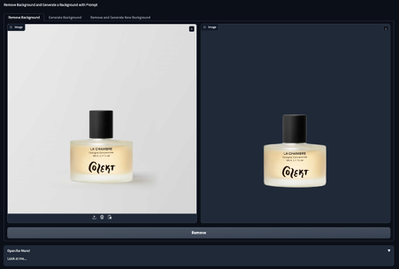
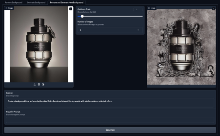
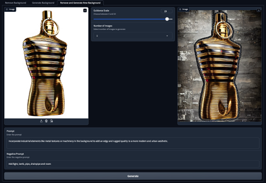

# remove-and-generate-background-with-stable-diffusion-inpaint

This project creates an API to removes the background of image and to generate background using the Stable Diffusion Inpainting algorithm by giving prompt after automatically masks the image.

## Requirements

Python 3.7 or higher

pip package manager

NVIDIA GPU (Recommended: Tesla T4)

CUDA

CUDNN libraries

### Remove background

### Generate backgorund

### Generate backgorund with negative prompt

